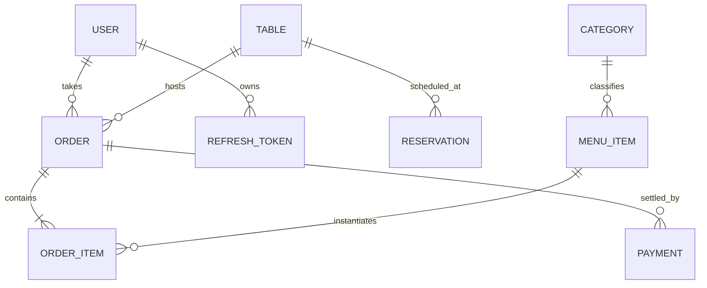

# Orderly — Premium Restaurant Management Ecosystem

A fully-integrated, full-stack restaurant operations platform engineered for high-performance service orchestration. Built with a scalable Java/Spring Boot ecosystem and a modern React-based administrative interface with premium glassmorphic aesthetics.

---

## 🛠️ Technology Stack

### 🔙 Backend Engineering


### 🎨 Frontend & UI


### ⚙️ DevOps & Documentation


---

## 💎 Core Features

- **🔐 Enterprise-Grade Security:** State-of-the-art stateless JWT authentication implementing secure refresh token rotation and fine-grained role-based access control (ADMIN, WAITER, KITCHEN).
- **🎭 'Midnight & Gold' Dashboard:** Real-time interactive venue map providing instantaneous visualization of dynamic table states (Available, Occupied, Reserved) with high-contrast UX.
- **📅 Integrated Reservation Engine:** Dynamic scheduling module with auto-table-blocking logic. Intelligently transitions physical assets from RESERVED to OCCUPIED upon client arrival.
- **🍳 Live KDS (Kitchen Display System):** Multi-stage queue pipeline (`PENDING → PREPARING → READY`) engineered with atomic transactional state updates to ensure absolute process reliability.
- **📦 Order Lifecycle Governance:** Granular item-level control mechanism, robust conflict resolution algorithms preventing state overrides, and streamlined checkout throughput.
- **📱 Contactless Assets:** Automated digital interaction points enabled by server-side high-fidelity QR code emission leveraging the ZXing engine.

---

## ⚡ Deployment Guide

### 🐳 Containerized Deployment (Highly Recommended)

The fastest way to provision both the service ecosystem and interactive frontplane along with robust database persistence.

```bash
# Clone the repository
git clone https://github.com/YOUR_USERNAME/orderly.git
cd orderly

# Trigger multi-stage deterministic build pipelines and daemonize
docker-compose up --build -d
```

Once deployment completes successfully, access metrics are provisioned as follows:

| Component | Network Location | Interface |
| :--- | :--- | :--- |
| **Frontend Client** | [http://localhost:5173](http://localhost:5173) | Web Application |
| **Central API** | [http://localhost:8080](http://localhost:8080) | Core Service |
| **API Schema** | [http://localhost:8080/swagger-ui/index.html](http://localhost:8080/swagger-ui/index.html) | OpenApi UI |

---

## 📐 Domain Architecture

### 📊 Entity Relationship Matrix



### 🏗️ Component Stratification (Backend)

```text
com.bora.orderly
├── 🚪 config/         # Security, CORS, JWT Strategies
├── 📡 controller/     # Exposed REST Boundaries (Contracts & Implementation)
├── 💼 service/        # Orchestration Layer & Transaction Boundaries
├── 💾 repository/     # Spring Data Data-Access Gateways
├── 📦 entity/         # Persistence Identity Models (JPA Hibernate)
├── 📨 dto/            # Ingress Validation (Requests) & Egress Contracts (Responses)
├── 🛠️ exception/      # Standardized Global Error Propagation Handling
└── 📑 enums/          # Rigid State Matrices (Order, Table, Item Statuses)
```

---

## 🚦 Pipeline Workflows

### 🛒 Order Progression Pipeline
```text
NEW ORDER ─► [PENDING] ─► [IN_PROGRESS] ─► [READY] ─► [DELIVERED] ─► [CLOSED/PAID]
                                │                                      │
                                └──────────────────────────────────────┘
                                              CANCELLED
```
*Table lifecycle hooks trigger automated atomic releases back to availability queues upon termination conditions (`CLOSED`, `CANCELLED`).*

### 📅 Reservation State Propagation
```text
DRAFT ─► [PENDING] ─► [CONFIRMED] ──┐ 
                              (Same-Day Event Triggers)
                                    ▼
                        TABLE STATE ◄═► [RESERVED] ─► [COMPLETED] ─► [AVAILABLE]
```

---

## 🛡️ Environment Configuration Matrix

Key variables configured in `docker-compose.yml` / `.env` to drive microservice behavior.

| Matrix Key | Baseline Config | Specification |
| :--- | :--- | :--- |
| `SPRING_DATASOURCE_URL` | `jdbc:postgresql://db:5432/orderlydb` | RDBMS connection URI |
| `JWT_SECRET` | `[SHA-256 SALT HASH]` | Cryptographic token signature seed |
| `JWT_EXPIRATION_MS` | `86400000` | Primary credential validity period |
| `VITE_API_URL` | `http://localhost:8080` | Cross-Origin reference link |

---

## 🖋️ Ownership & Licensing

**Authored by:** Bora ([GitHub Profile](https://github.com/YOUR_USERNAME))  
**License Scope:** Open Distributed and transparent under the provisions of the [MIT License](LICENSE).
