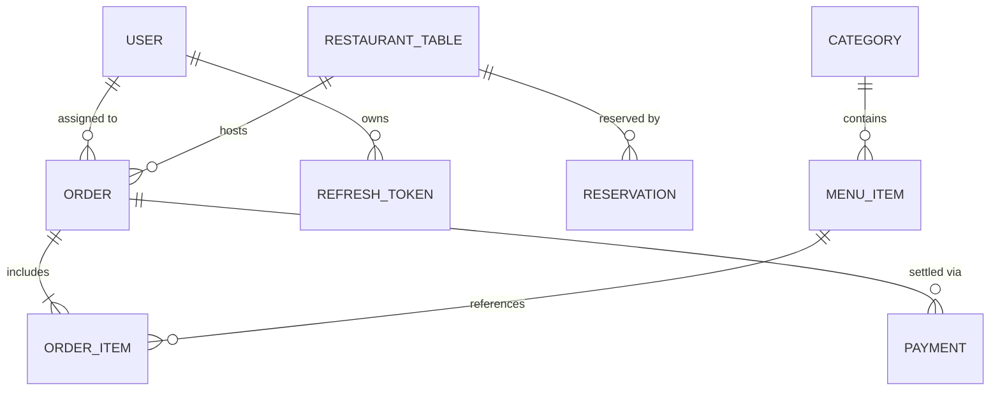

# Orderly

A full-stack restaurant management system built with Spring Boot and React. Covers the complete operational flow — from table reservations and order management to kitchen display and payment.

---

## Tech Stack

**Backend**


**Frontend**


**Infrastructure**


---

## Features

- **Authentication & Authorization** — Stateless JWT with refresh token rotation. Role-based access control across three roles: `ADMIN`, `WAITER`, `KITCHEN`.
- **Table Management** — Real-time venue map with dynamic table states (`AVAILABLE`, `OCCUPIED`, `RESERVED`). QR code generation per table via ZXing.
- **Reservation System** — Create and manage reservations with capacity validation. Same-day confirmed reservations automatically block the table. Transitioning a reservation to "arrived" frees the table and opens the order flow directly.
- **Order Management** — Full order lifecycle with item-level granularity. Conflict detection prevents duplicate active orders per table.
- **Kitchen Display System (KDS)** — Three-stage queue (`PENDING → IN_PROGRESS → READY`). Supports marking individual items or the entire order as ready via a single atomic transaction. Served orders are manually cleared from the display.
- **Payment** — Partial payment, tip recording, and automatic table release on order close.

---

## Getting Started

### Docker (Recommended)

Starts the backend, frontend, and database with a single command. No local Java or PostgreSQL required.

```bash
git clone https://github.com/YalcinBoraDincer/orderly.git
cd orderly
docker-compose up --build -d
```

| Service     | URL                                              |
| :---------- | :----------------------------------------------- |
| Frontend    | http://localhost:80                              |
| Backend API | http://localhost:8080                            |
| Swagger UI  | http://localhost:8080/swagger-ui/index.html      |

### Without Docker

```bash
# Requires a running PostgreSQL instance.
# Update connection details in src/main/resources/application.properties

./mvnw spring-boot:run

# For the frontend:
cd orderly-frontend
npm install && npm run dev
```

---

## Architecture

### Backend Package Structure

```
com.bora.orderly
├── config/       # Security, CORS, JWT configuration
├── controller/   # REST layer — interfaces (Swagger docs) and implementations
├── service/      # Business logic and transaction management
├── repository/   # Spring Data JPA repositories
├── entity/       # JPA entities
├── dto/          # Request validation and response mapping
├── exception/    # Global error handling with consistent JSON responses
└── enums/        # UserRole, OrderStatus, TableStatus, ItemStatus, ReservationStatus
```

### Database Schema



---

## Workflows

### Order Lifecycle

```
CREATE → PENDING → IN_PROGRESS → READY → DELIVERED → CLOSED
                                                  └──→ CANCELLED
```

Closing or cancelling an order automatically sets the table back to `AVAILABLE`.

### Reservation Lifecycle

```
PENDING → CONFIRMED → (same-day trigger) → table: RESERVED
                                        → COMPLETED → table: AVAILABLE
                    → CANCELLED         → table: AVAILABLE
```

---

## API Overview

| Module       | Base Path              | Roles             |
| :----------- | :--------------------- | :---------------- |
| Auth         | `/api/auth`            | Public            |
| Menu         | `/api/menu`            | Public / ADMIN    |
| Categories   | `/api/categories`      | Public / ADMIN    |
| Tables       | `/api/tables`          | Authenticated     |
| Orders       | `/api/orders`          | Authenticated     |
| Kitchen      | `/api/kitchen`         | KITCHEN / ADMIN   |
| Reservations | `/api/reservations`    | WAITER / ADMIN    |
| Payments     | `/api/payments`        | Authenticated     |

Full interactive documentation is available at `/swagger-ui/index.html` when the application is running.

---

## Environment Variables

| Variable                  | Default                               | Description                  |
| :------------------------ | :------------------------------------ | :--------------------------- |
| `SPRING_DATASOURCE_URL`   | `jdbc:postgresql://db:5432/orderlydb` | Database connection URL      |
| `DB_USERNAME`             | `postgres`                            | Database user                |
| `DB_PASSWORD`             | —                                     | Database password            |
| `JWT_SECRET`              | —                                     | Signing key (min. 32 chars)  |
| `JWT_EXPIRATION_MS`       | `86400000`                            | Access token TTL (24h)       |
| `JWT_REFRESH_EXPIRATION`  | `604800000`                           | Refresh token TTL (7 days)   |

---

## Author

**Bora** — [github.com/YalcinBoraDincer](https://github.com/YalcinBoraDincer)

MIT License
